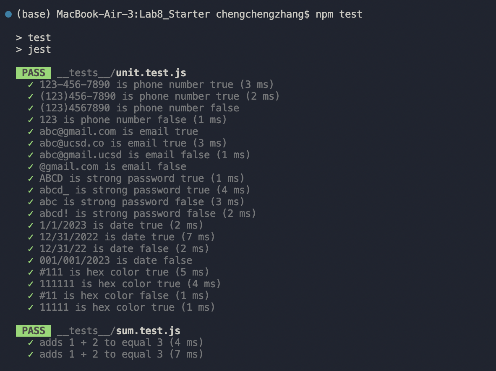
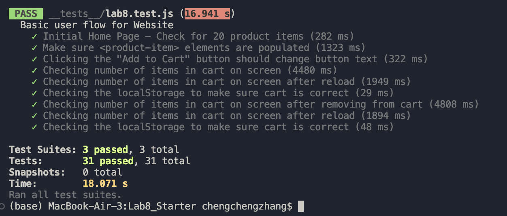

# Lab 8 - Chengcheng Zhang
1) Where would you fit your automated tests in your Recipe project development pipeline? Select one of the following and explain why.

   Within a Github action that runs whenever code is pushed. Since in this case, we can get to know what is going on with the existing code autonatically and fix the bugs if there are any. Also, within a Github action that runs whenever code is pushed makes our teammates know the status of the exsiting codes if it passed the tests or not.
2) Would you use an end to end test to check if a function is returning the correct output? (yes/no)

   No
3) Would you use a unit test to test the “message” feature of a messaging application? Why or why not? For this question, assume the “message” feature allows a user to write and send a message to another user.

   No, since the "message" feature involve multiple components interacting with each other such as writing and sending the message and unit tests cannot test these.
4) Would you use a unit test to test the “max message length” feature of a messaging application? Why or why not? For this question, assume the “max message length” feature prevents the user from typing more than 80 characters.

   Yes, since the max message length feature is in a small scale and the unit tests could execute quickly to debug any issues if there're any.

   
   
